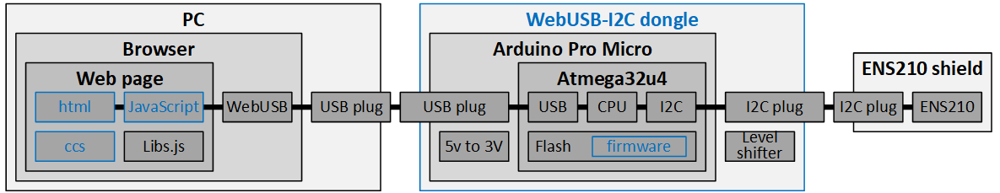
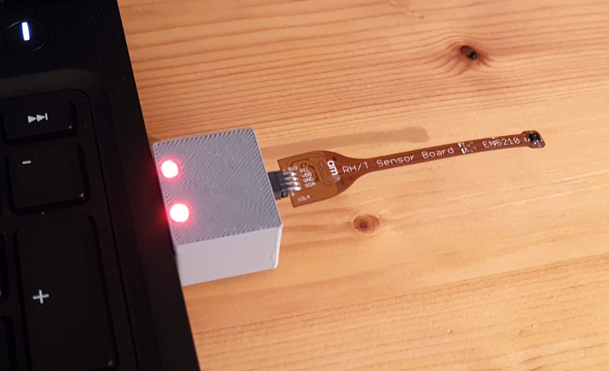
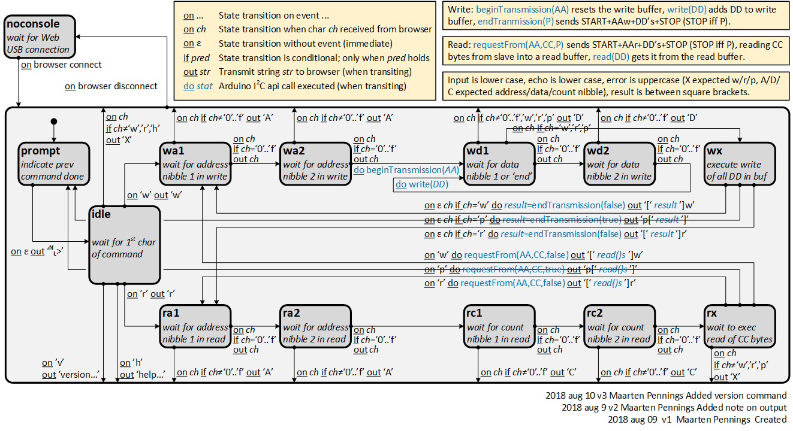

# WebUSB-I2C
Sending commands from a browser (web page with JavaScript) via a WebUSB dongle to an I2C slave.

## Introduction
This project implements a WebUSB to I2C dongle, and uses the ENS210 I2C slave as an example.

The system consists of a PC, a WebUSB-I2C dongle, and an I2C slave like the [ENS210 from ams](https://ams.com/ens210).
The dongle has two connectors. The first connector is a USB connecter which allows plugging the dongle into a PC. 
The second connector is a four pin header with I2C (SCL, SDA) and power (VDD and GND) which allows plugging in an I2C slave (shield).
See the figure below for a system overview. The boxes in blue are new, and documented in this project.

The first major component is the WebUSB-I2C dongle. It contains an Arduino Pro Micro. This is a board with a USB connector 
and an Atmega32u4 microcontroller. The Atmega32u4 was chosen, because it has embedded USB hardware, which means that the 
firmware can implement the wanted USB functionality: a Web USB CDC stack. Web USB is a standard that allows web browsers 
to communicate with USB hardware (see [WebUSB-LED](https://github.com/maarten-pennings/WebUSB-LED) for an intro). 
The firmware not only implements the Web USB stack, it also implements a simple command interpreter. The command interpreter
lets the web page send commands to write or read bytes over the I2C bus, communicating to an I2C slave (an ENS210 in our case).

The second major component is the web page. This project offers two pages. One is a generic terminal so that the user can type
the commands for the dongle in a console in a web browser and see the responses back. The second web page contains 
JavaScript that implements an ENS210 driver and graphs the results.

## WebUSB-I2C dongle
As can be seen in the system overview image above, the WebUSB dongle hardware is largely standard:
 * I used a small Arduino Pro Micro: a [Bad USB](https://www.aliexpress.com/item/Beetle-Virtual-Keyboard-BadUSB-Pro-Micro-ATMEGA32U4-Module-Mini-Development-Expansion-Board-For-Arduino-Leonardo-R3/32845916898.html) (or [alternative](https://www.aliexpress.com/item/Free-shipping-SS-micro-ATMEGA32U4-module-compatible-for-arduino-pro-micro/32660718568.html))  development board. It has a 5V to 3V LDO on board.
 * I added an I2C [level shifter](https://www.aliexpress.com/item/5pcs-lot-5V-3V-IIC-UART-SPI-Four-Channel-Level-Converter-Module-for-Arduino-Free-Shipping/1821378018.html) or ([alternative](https://www.aliexpress.com/item/Logic-Level-Shifter-Bi-Directional-Four-way-two-way-logic-level-transformation-module/32376035003.html)) since most of my I2C slaves (like the ENS210) run on 3V3, not 5V0.
 * I added a home-made board with an I2C "shield" connector.
 * I did not add pull-ups on the I2C pins (I assume they are present internally).

The figure below shows the small Pro Micro ...
 

... and the sandwich of the three boards I soldered together.

I 3D printed a small case (note the light guides for the LEDs) ...

... the I2C connector can mate with e.g. the ENS210 shield ...

... and the complete setup looks like this

Software wise, I added the WebUSB stack, see [WebUSB-LED](https://github.com/maarten-pennings/WebUSB-LED) for an intro. 
Secondly, I added a command interpreter that maps one-to-one on the Arduino I2C API. See the state machine below for the mapping.
This serves as documentation of a large part of the firmware.

The screenshot below shows a terminal session in Chrome, using commands to communicate with an ENS210.

We see
 * `w43p` a ping (write to slave address 0x43 with no payload), which was successful (result `[00]`). 
   Note that 0x43 is the slave address of the ENS210.
 * `w4310r4301p` a write to the ENS210 of 0x10 (address of register SYS_CTRL), followed by a read of 0x01 bytes.
   The write was successful (result `[00]`) and the read shows `[01]`, that is low power enabled. 
 * `w431000p` a write to the ENS210 value 0x00 (disable low power) to register SYS_CTRL at address 0x10. 
 * Again `w4310r4301p` to confirm that SYS_CTRL has disabled low power (read now returns `[00]`).
 * Finally a read of the two-byte PART_ID register at address 0x00 `w4300r4302p`.
   The write was successful (result `[00]`) and the read shows `[1002]`, low endian for 0x0210, the part id of ENS210. 
 * Finally, the `w44p` is a ping to device 0x44, which is not connected and thus fails (result `[02]`). 
   See [Arduino](https://www.arduino.cc/en/Reference/WireEndTransmission) for the error codes for write.

By the way, note the USB icon (the "fork") in the Chrome tab (just to the right of the X for closing the tab). 
It pops up at the moment a web page has established connection with a Web USB device.

## WebUSB-I2C web pages

WORK IN PROGRESS

 * standard [console](https://webusb.github.io/arduino/demos/console/) 
 * ENS210 graphs
 
(end)
